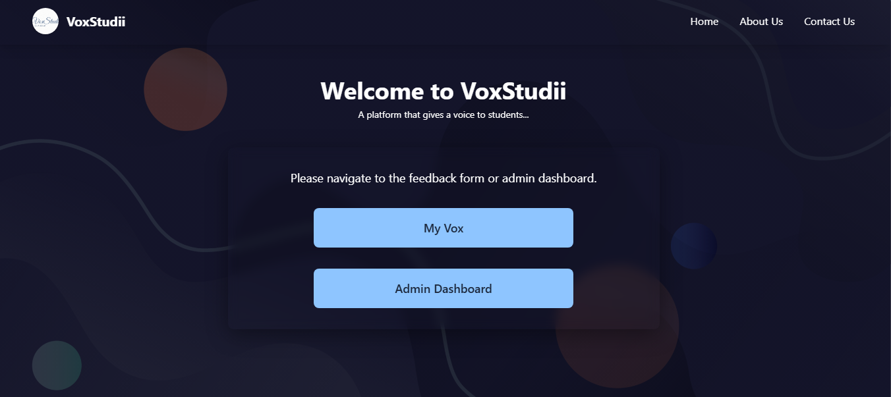
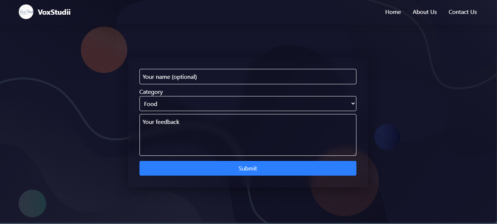
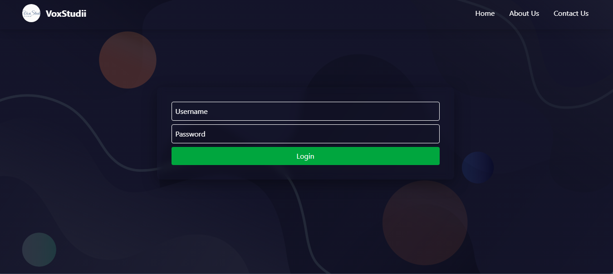

# VoxStudii 🎓📢

VoxStudii is a feedback management platform designed to improve communication between students and administrators. It allows students to submit categorized feedback and enables administrators to manage and respond effectively. 

Admins are also notified via email if they haven't logged in within the past 7 days, ensuring timely attention to student feedback.

---

## 🌟 Preview

### 🏠 Homepage

### 📝 Feedback Form

### 🔐 Admin Login


### 📋 Dashboard (after login)
*(Include this screenshot here when available)*

---

## ✨ Features

### 🧑‍🎓 Students:
- Submit feedback in specific categories: Mess, Hostel, Academics, Others.
- Easy-to-use, clean interface.
- Option to remain anonymous or include name.

### 🧑‍💼 Admins:
- View feedback by category.
- Receive **email reminders** if not logged in for more than 7 days.
- Secure login system.

---

## ⚙️ Tech Stack

- **Frontend**: React + vite , Tailwind
- **Backend**: NodeJs , Express Js 
- **Database**: Mongodb 
- **Email Alerts**: `node mailer`

---

## 📁 Project Structure

```bash
voxstudii/
|--- backend
|    |----controllers
|    |----models
|    |----router
|    |----utils
|    |----app.js
|    |----index.js
|--- frontend
|    |----src
|         |----components
|         |----app.jsx
|         |----main.jsx
|         |----app.css    
